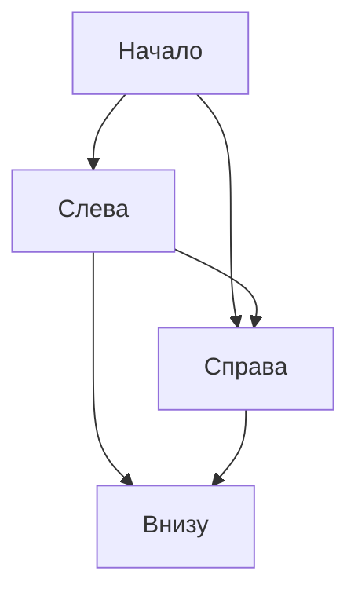

```git add .``` точка это значит файлы в текущем каталоге  
```git add --all``` добавить все файлы из проекта в staged  

### А теперь проверим работает ли русалка на gitHub?!

```mermaid
  graph TD;
      Начало-->Слева;
      Начало-->Справа;
      Слева-->Справа;
      Слева-->Внизу;
      Справа-->Внизу;
```
